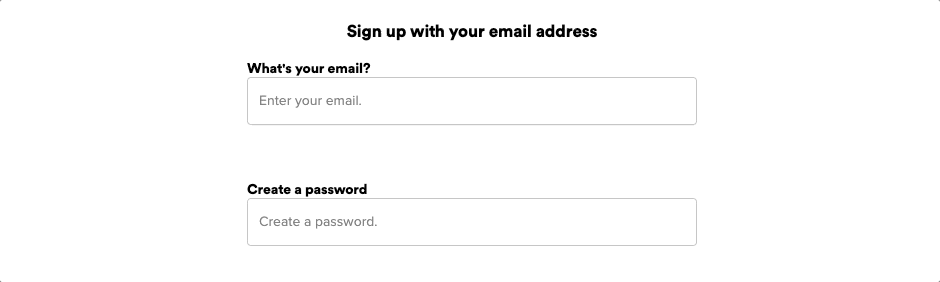
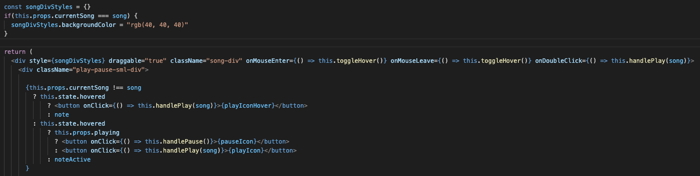

# Spudify
Spudify is an audio streaming platform inspired by Spotify.  Guests can browse content,  enjoy complementary access, and indulge in their favorite sounds.

[Check out Spudify](https://spudify.herokuapp.com/#/us)

To build Spudify, I used the following stack:
  * Ruby on Rails - web-application framework
  * Postgresql - database management
  * React - front-end rendering
  * Redux - state-management

Spudify was designed with modularity in mind.  By leveraging React component nesting, I was able to design a guest experience that is infinitely customizable.  Conditionally rendering components based on any number of factors, including a user’s signed in status, means full control over touchpoints and allows for simple funnel testing and ultimately, enhanced conversions. Modularity has the added benefit of seemless site maintenance, and no service disruptions.

| signed out | signed in |
| ------------- |:-------------:|
|  | |

## Sign up and Login

## Playlists

## Songs
It was important to me to be able to provide listeners with a listening experience they are familiar with, and I found so many seemingly trivial details that collectively contribute to a pleasurable streaming session that is uniquely Spotify.  Having no prior experience or familiarity with the inner workings of Spotify, I took great care in exercising my technical and creative abilities to replicate the functionality and styling of an app that is as user friendly as it is technically nuanced.  

Planning was crucial in ensuring a logical heirarchy of React components.  For the web player, I decided to nest components in the following order:

LeftNav
MainContent > 
              PlaylistContent > 
                                Song
              AlbumContent  >
                              Song
              ArtistContent
MediaBar

Reusable components save time and keep code dry.  Given the functional and stylistic similarities between playlist songs and album songs, I decided to keep my code base dry and create one reusable song component that could be shared between both playlist and album parent components.  

